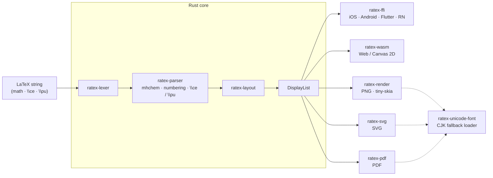

# RaTeX

[简体中文](README.zh-CN.md) | **English**

**KaTeX-compatible math rendering engine in pure Rust — no JavaScript, no WebView, no DOM.**

One Rust core, one display list, every platform renders natively.

```
\frac{-b \pm \sqrt{b^2-4ac}}{2a}   →   iOS · Android · Flutter · React Native · Web · PNG · SVG · PDF
```

**[→ Live Demo](https://erweixin.github.io/RaTeX/demo/live.html)** — type LaTeX and compare RaTeX vs KaTeX side-by-side ·
**[→ Support table](https://erweixin.github.io/RaTeX/demo/support-table.html)** — RaTeX vs KaTeX across all test formulas ·
**[→ Web benchmark](https://erweixin.github.io/RaTeX/demo/benchmark.html)** — head-to-head perf in the browser

---

## Why RaTeX?

Every major cross-platform math renderer today runs LaTeX through a browser or JavaScript engine — a hidden WebView eating 50–150 MB RAM, startup latency before the first formula, no offline guarantee. KaTeX is excellent on the web, but on every other surface — iOS, Android, Flutter, server-side, embedded — you're either hosting a WebView or shelling out to headless Chrome.

RaTeX is the same KaTeX-compatible math engine compiled to a portable Rust core, so the *same* renderer runs natively everywhere — and produces byte-identical output across every target.

| | KaTeX | MathJax | **RaTeX** |
|---|---|---|---|
| Runtime | JS (V8) | JS (V8) | **Pure Rust** |
| Surfaces it runs on | Web only* | Web only* | **iOS · Android · Flutter · RN · Web · server · SVG · PDF** |
| Mobile | WebView wrapper | WebView wrapper | **Native** |
| Server-side rendering | headless Chrome | mathjax-node | **Single binary, no JS runtime** |
| Output substrate | DOM (`<span>` tree) | DOM / SVG | **Display list → Canvas / PNG / SVG / PDF** |
| Memory | GC / heap | GC / heap | **Predictable, no GC** |
| Offline | Depends | Depends | **Yes** |
| Syntax coverage | 100% | ~100% | **Aligned with KaTeX math syntax** |

<sub>\* Embeddable in non-web targets only by hosting a WebView or headless browser, which most native and server contexts can't tolerate.</sub>

**On the web specifically**, KaTeX has a decade of V8 JIT optimization behind it and remains the obvious choice for web-only projects. RaTeX's contribution isn't beating it on its home turf — it's being the only KaTeX-compatible engine that runs natively on every *other* surface, with pixel-identical output across all of them.

---

## What it renders

**Math** — **Aligned with KaTeX’s math syntax**: fractions, radicals, integrals, matrices, environments, stretchy delimiters, and more. The small set of DOM / trust-related extensions (e.g. `\includegraphics`, `\htmlClass`, …) is documented under *KaTeX differences (commands & DOM)* below.

**Chemistry** — full mhchem support via `\ce` and `\pu`:

```latex
\ce{H2SO4 + 2NaOH -> Na2SO4 + 2H2O}
\ce{Fe^{2+} + 2e- -> Fe}
\pu{1.5e-3 mol//L}
```

**Physics units** — `\pu` for value + unit expressions following IUPAC conventions.

### KaTeX differences (commands & DOM)

These are the **command-level** gaps vs KaTeX (including `trust`-style HTML). Typical math and mhchem inputs are aligned with KaTeX. Some formulas still score below 1.0 in the [support table](https://erweixin.github.io/RaTeX/demo/support-table.html) or golden ink comparison due to layout/metrics/rasterization vs reference PNGs — that is **not** the same as “missing syntax” in the table below.

| KaTeX input | Notes |
|-------------|------|
| `\includegraphics[…]{…}` | **Not supported:** parser has no handler (undefined control sequence). |
| `\htmlClass`, `\htmlData`, `\htmlId` | **Not equivalent:** expanded as macros that **drop** the first argument’s `class` / `data-*` / `id` and keep only the second-argument body (unlike KaTeX trusted DOM attributes). |
| `\htmlStyle{…}{…}` | **Partial:** simple inline styling may work on Web/Canvas paths; behavior may still differ from KaTeX’s DOM-based HTML extension. |

---

## Platform targets

| Platform | How | Status |
|---|---|---|
| **iOS** | XCFramework + Swift / CoreGraphics | Out of the box |
| **Android** | JNI + Kotlin + Canvas · AAR | Out of the box |
| **Flutter** | Dart FFI + `CustomPainter` | Out of the box |
| **React Native** | Native module + C ABI · iOS/Android views | Out of the box |
| **Compose Multiplatform** | Kotlin Multiplatform + Compose Canvas · Android / iOS / JVM Desktop | Via [`RaTeX-CMP`](https://github.com/darriousliu/RaTeX-CMP) |
| **Web** | WASM → Canvas 2D · `<ratex-formula>` Web Component | Out of the box |
| **Server / CI** | tiny-skia → PNG rasterizer | Out of the box |
| **SVG** | `ratex-svg` → self-contained vector SVG | Out of the box |
| **PDF** | `ratex-pdf` → vector PDF with embedded KaTeX fonts | Out of the box |

### Screenshots

From the demo apps in [`demo/screenshots/`](demo/screenshots/).

<table>
  <tr>
    <th width="50%">iOS</th>
    <th width="50%">Android</th>
  </tr>
  <tr>
    <td align="center"></td>
    <td align="center"></td>
  </tr>
  <tr>
    <th width="50%">Flutter (iOS)</th>
    <th width="50%">React Native (iOS)</th>
  </tr>
  <tr>
    <td align="center"></td>
    <td align="center"></td>
  </tr>
  <tr>
    <th colspan="2">Compose Multiplatform</th>
  </tr>
  <tr>
    <td colspan="2" align="center"></td>
  </tr>
</table>

---

## Architecture



| Crate | Role |
|---|---|
| `ratex-types` | Shared types: `DisplayItem`, `DisplayList`, `Color`, `MathStyle` |
| `ratex-font` | KaTeX-compatible font metrics and symbol tables |
| `ratex-lexer` | LaTeX → token stream |
| `ratex-parser` | Token stream → ParseNode AST; mhchem `\ce` / `\pu`; auto-numbering for `equation` / `align` / `gather` / `alignat` and end-of-row `\tag` / `\nonumber` / `\notag` |
| `ratex-layout` | AST → LayoutBox tree → DisplayList |
| `ratex-ffi` | C ABI: exposes the full pipeline for native platforms |
| `ratex-wasm` | WASM: pipeline → DisplayList JSON for the browser |
| `ratex-render` | Server-side: DisplayList → PNG (tiny-skia) |
| `ratex-svg` | SVG export: DisplayList → SVG string |
| `ratex-pdf` | PDF export: DisplayList → PDF bytes ([pdf-writer](https://docs.rs/pdf-writer), embedded CID fonts) |
| `ratex-unicode-font` | System Unicode / CJK font discovery for fallback rendering |

---

## Quick start

**Requirements:** Rust 1.70+ ([rustup](https://rustup.rs))

```bash
git clone https://github.com/erweixin/RaTeX.git
cd RaTeX
cargo build --release
```

### Render to PNG

```bash
echo '\frac{1}{2} + \sqrt{x}' | cargo run --release -p ratex-render -- --color '#1E88E5'

echo '\ce{H2SO4 + 2NaOH -> Na2SO4 + 2H2O}' | cargo run --release -p ratex-render
```

### Render to SVG

```bash
# Default: glyphs as <text> elements (correct display requires KaTeX webfonts)
echo '\frac{1}{2} + \sqrt{x}' | cargo run --release -p ratex-svg --features cli -- --color '#1E88E5'

# Standalone: embed glyph outlines as <path> — no external fonts needed
echo '\int_0^\infty e^{-x^2} dx = \frac{\sqrt{\pi}}{2}' | \
  cargo run --release -p ratex-svg --features "cli embed-fonts" -- \
  --output-dir ./out
```

The `standalone` feature (enabled by `cli`) reads KaTeX TTF files from `--font-dir` and embeds glyph outlines directly into the SVG, producing a fully self-contained file that renders correctly without any CSS or web fonts.

The `embed-fonts` feature (implicitly enables `standalone`) bundles the same TTFs via the [`ratex-katex-fonts`](crates/ratex-katex-fonts) crate, so no `--font-dir` is needed and builds from crates.io stay self-contained. To refresh bundled fonts after upgrading KaTeX, run [`scripts/sync-katex-ttf-to-font-crate.sh`](scripts/sync-katex-ttf-to-font-crate.sh).

### Render to PDF

```bash
# `cli` implies `embed-fonts`: KaTeX TTFs are bundled via ratex-katex-fonts (--font-dir is ignored)
echo '\frac{1}{2} + \sqrt{x}' | cargo run --release -p ratex-pdf --features cli -- --output-dir ./out

# Equivalent font loading (explicit embed-fonts)
echo '\ce{H2SO4 + 2NaOH -> Na2SO4 + 2H2O}' | \
  cargo run --release -p ratex-pdf --features "cli embed-fonts" -- --output-dir ./out
```

The `ratex-pdf` crate writes one `.pdf` per non-empty line from stdin. Options include `--output-dir` (default `output_pdf`), `--font-size`, `--dpr`, and `--inline` (text style instead of display). The `render-pdf` binary always loads fonts from `ratex-katex-fonts`, so `--font-dir` does not change embedding. For library use without `embed-fonts`, set `PdfOptions.font_dir` to your KaTeX TTF directory instead.

### CJK / Unicode fallback

By default RaTeX bundles only KaTeX fonts (19 faces for math symbols). Characters outside the KaTeX glyph set — CJK ideographs, emoji, Hangul, etc. — are rendered via a system Unicode font discovered automatically:

1. **`RATEX_UNICODE_FONT`** env var — path to any `.ttf`/`.otf`/`.ttc`, with optional `#index` or `#FamilyName` selector for TTC collections (e.g. `NotoSansCJK.ttc#Noto Sans CJK SC`)
2. **Hard-coded system paths** — Linux (`/usr/share/fonts/opentype/noto/NotoSansCJK-Regular.ttc`), macOS (`/Library/Fonts/Arial Unicode.ttf`, `/System/Library/Fonts/Supplemental/Arial Unicode.ttf`), Windows (`C:\Windows\Fonts\NotoSansSC-VF.ttf`, `C:\Windows\Fonts\msyh.ttc`)
3. **Locale-aware system discovery** — `system-fonts` resolves prioritized Sans candidates for the current system locale / region, including TTC family selection when needed

```bash
# Explicit font path (recommended for CI / server environments)
RATEX_UNICODE_FONT=/path/to/NotoSansSC-Regular.ttf \
  echo '\text{你好世界}' | cargo run --release -p ratex-render

# Auto-discovery probes built-in paths first, then locale-aware system Sans fallbacks.
echo '\text{你好世界}' | cargo run --release -p ratex-render
```

All three renderers (PNG, SVG, PDF) use the same discovery crate (`ratex-unicode-font`), so once a font is found the output is consistent across all formats. For variable fonts, RaTeX prefers the Regular `wght=400` instance when that axis is available so outline extraction, metrics, and PDF subsetting stay aligned. For PNG and standalone SVG, glyph outlines are embedded as paths. For PDF, the detected CJK glyphs are subsetted and embedded as a CIDFontType2 font.

### Browser (WASM)

```bash
npm install ratex-wasm
```

```html
<link rel="stylesheet" href="node_modules/ratex-wasm/fonts.css" />
<script type="module" src="node_modules/ratex-wasm/dist/ratex-formula.js"></script>

<ratex-formula latex="\frac{-b \pm \sqrt{b^2-4ac}}{2a}" font-size="48" color="#1E88E5"></ratex-formula>
<ratex-formula latex="\ce{CO2 + H2O <=> H2CO3}" font-size="32"></ratex-formula>
```

See [`platforms/web/README.md`](platforms/web/README.md) for the full setup.

### Platform glue layers

| Platform | Docs |
|---|---|
| iOS | [`platforms/ios/README.md`](platforms/ios/README.md) |
| Android | [`platforms/android/README.md`](platforms/android/README.md) |
| Flutter | [`platforms/flutter/README.md`](platforms/flutter/README.md) |
| React Native | [`platforms/react-native/README.md`](platforms/react-native/README.md) |
| Compose Multiplatform | [`RaTeX-CMP`](https://github.com/darriousliu/RaTeX-CMP) |
| Web | [`platforms/web/README.md`](platforms/web/README.md) |

### Run tests

```bash
cargo test --all
```

---

## Equation numbering and `\tag`

RaTeX follows KaTeX-style layout for numbered display environments.

- **Auto-numbering** applies to non-starred `equation`, `align`, `alignat`, and `gather`: each logical row gets a sequential tag such as `(1)`, `(2)`, … . Starred forms (`equation*`, `align*`, …) and inner environments **`aligned`**, **`alignedat`**, **`split`**, and **`gathered`** do **not** auto-number (same idea as LaTeX: only the outer display is numbered).
- **`\tag{...}`** / **`\tag*{...}`** at the **end** of a row replace the auto number for that row (amsmath-style). Empty `\tag{}` suppresses the number for that row.
- **`\nonumber`** and **`\notag`** at the **end** of a row suppress the number for that row when auto-numbering is active. They cannot be combined with `\tag` on the same row.
- **`\notag`** is implemented as an alias of **`\nonumber`** (same as above).

Document-level options such as `\leqno` and cross-reference counters are not modeled; numbering starts from `(1)` within the parse of each formula string.

---

## Acknowledgements

RaTeX owes a great debt to [KaTeX](https://katex.org/) — its parser architecture, symbol tables, font metrics, and layout semantics are the foundation of this engine. Chemistry notation (`\ce`, `\pu`) is powered by a Rust port of the [mhchem](https://mhchem.github.io/MathJax-mhchem/) state machine.

---

## Contributing

See [`CONTRIBUTING.md`](CONTRIBUTING.md). To report a security issue, see [`SECURITY.md`](SECURITY.md).

---

## License

MIT — Copyright (c) erweixin.
