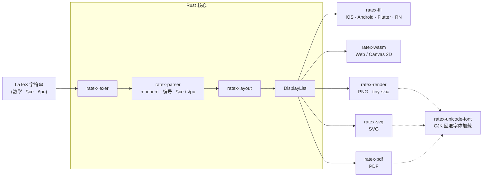

# RaTeX

**简体中文** | [English](README.md)

**纯 Rust 实现的 KaTeX 兼容数学渲染引擎 — 无 JavaScript、无 WebView、无 DOM。**

一个 Rust 核心，一套显示列表，各平台原生渲染。

```
\frac{-b \pm \sqrt{b^2-4ac}}{2a}   →   iOS · Android · Flutter · React Native · Web · PNG · SVG · PDF
```

**[→ 在线演示](https://erweixin.github.io/RaTeX/demo/live.html)** — 输入 LaTeX，对比 RaTeX vs KaTeX ·
**[→ 支持表](https://erweixin.github.io/RaTeX/demo/support-table.html)** — 全量测试公式的 RaTeX vs KaTeX 对比 ·
**[→ Web 性能基准](https://erweixin.github.io/RaTeX/demo/benchmark.html)** — 浏览器内的正面性能对比

---

## 为什么选 RaTeX？

目前主流的跨平台数学渲染方案都依赖浏览器或 JavaScript 引擎跑 LaTeX，带来隐藏 WebView 占用 50–150 MB 内存、首屏公式要等 JS 启动、无法保证离线等问题。KaTeX 在 Web 上非常出色，但在其他任何目标——iOS、Android、Flutter、服务端、嵌入式——你要么内嵌 WebView，要么调用 headless Chrome。

RaTeX 是同一个 KaTeX 兼容的数学引擎，但编译到一个可移植的 Rust 核心：**同一套渲染器在每个平台原生运行**，并在所有目标上产出**像素一致**的输出。

| | KaTeX | MathJax | **RaTeX** |
|---|---|---|---|
| 运行时 | JS (V8) | JS (V8) | **纯 Rust** |
| 可运行的目标 | 仅 Web* | 仅 Web* | **iOS · Android · Flutter · RN · Web · 服务端 · SVG · PDF** |
| 移动端 | WebView 套壳 | WebView 套壳 | **原生** |
| 服务端渲染 | headless Chrome | mathjax-node | **单二进制，无需 JS 运行时** |
| 输出形态 | DOM（`<span>` 树）| DOM / SVG | **显示列表 → Canvas / PNG / SVG / PDF** |
| 内存模型 | GC / 堆 | GC / 堆 | **可预期，无 GC** |
| 离线 | 视情况 | 视情况 | **支持** |
| 语法覆盖 | 100% | ~100% | **与 KaTeX 数学语法对齐** |

<sub>\* 在非 Web 目标上只能通过内嵌 WebView 或 headless 浏览器使用，而大多数原生和服务端场景都无法接受这种方式。</sub>

**单看 Web**，KaTeX 背后有十年的 V8 JIT 优化积累，对纯 Web 项目仍然是显而易见的选择。RaTeX 的价值不在于在 KaTeX 的主场击败它，而在于：它是**唯一**一个能在所有其他平台原生运行的 KaTeX 兼容引擎，且在所有平台之间输出像素一致。

---

## 能渲染什么

**数学公式** — 与 KaTeX **数学语法**对齐：分数、根号、积分、矩阵、各类环境、伸缩定界符等。与 DOM / 信任模式相关的少数扩展（如 `\includegraphics`、`\htmlClass` 等）见下文「与 KaTeX 的差异」。

**化学方程式** — 通过 `\ce` 和 `\pu` 完整支持 mhchem：

```latex
\ce{H2SO4 + 2NaOH -> Na2SO4 + 2H2O}
\ce{Fe^{2+} + 2e- -> Fe}
\pu{1.5e-3 mol//L}
```

**物理单位** — `\pu` 支持符合 IUPAC 规范的数值+单位表达式。

### 与 KaTeX 的差异（命令 / DOM）

下列为相对 **KaTeX 默认能力**（含 `trust` 等设置）在**命令级**上仍不一致或缺失的条目；**常见数学与 mhchem 写法**已与 KaTeX 对齐。个别公式在 [支持表](https://erweixin.github.io/RaTeX/demo/support-table.html) 或 golden 中与参考图 **墨量分数**略有差异，属于版式/光栅化与参考 PNG 的差异，**不**等同于下表中的「缺命令」。

| KaTeX 输入 | 说明 |
|-------------|------|
| `\includegraphics[…]{…}` | **不支持**：当前解析器无该命令（未定义控制序列）。 |
| `\htmlClass`、`\htmlData`、`\htmlId` | **不等价**：为兼容输入，宏展开为**仅第二参数正文**；不保留第一参数中的 `class` / `data-*` / `id`（与 KaTeX 在 `trust` 下写入 DOM 的行为不同）。 |
| `\htmlStyle{…}{…}` | **部分支持**：Web/Canvas 等对简单内联样式有路径，与 KaTeX 基于 DOM 的 HTML 扩展**未必**逐像素一致；详见实现与 golden。 |

---

## 平台支持

| 平台 | 方式 | 状态 |
|---|---|---|
| **iOS** | XCFramework + Swift / CoreGraphics | 开箱即用 |
| **Android** | JNI + Kotlin + Canvas · AAR | 开箱即用 |
| **Flutter** | Dart FFI + `CustomPainter` | 开箱即用 |
| **React Native** | C ABI Native 模块 · iOS/Android 原生视图 | 开箱即用 |
| **Compose Multiplatform** | Kotlin Multiplatform + Compose Canvas · Android / iOS / JVM Desktop | 通过 [`RaTeX-CMP`](https://github.com/darriousliu/RaTeX-CMP) 集成 |
| **Web** | WASM → Canvas 2D · `<ratex-formula>` Web 组件 | 开箱即用 |
| **服务端 / CI** | tiny-skia → PNG 光栅化 | 开箱即用 |
| **SVG** | `ratex-svg` → 自包含矢量 SVG 导出 | 开箱即用 |
| **PDF** | `ratex-pdf` → 内嵌 KaTeX 字体的矢量 PDF | 开箱即用 |

### 截图

演示应用截图见 [`demo/screenshots/`](demo/screenshots/)。

<table>
  <tr>
    <th width="50%">iOS</th>
    <th width="50%">Android</th>
  </tr>
  <tr>
    <td align="center"></td>
    <td align="center"></td>
  </tr>
  <tr>
    <th width="50%">Flutter（iOS）</th>
    <th width="50%">React Native（iOS）</th>
  </tr>
  <tr>
    <td align="center"></td>
    <td align="center"></td>
  </tr>
  <tr>
    <th colspan="2">Compose Multiplatform</th>
  </tr>
  <tr>
    <td colspan="2" align="center"></td>
  </tr>
</table>

---

## 架构



| Crate | 职责 |
|---|---|
| `ratex-types` | 共享类型：`DisplayItem`、`DisplayList`、`Color`、`MathStyle` |
| `ratex-font` | 兼容 KaTeX 的字体度量与符号表 |
| `ratex-lexer` | LaTeX → token 流 |
| `ratex-parser` | token 流 → ParseNode AST；mhchem `\ce` / `\pu`；`equation` / `align` / `gather` / `alignat` 等环境的自动编号与行末 `\tag` / `\nonumber` / `\notag` |
| `ratex-layout` | AST → LayoutBox 树 → DisplayList |
| `ratex-ffi` | C ABI：向各原生平台暴露完整流水线 |
| `ratex-wasm` | WASM：流水线 → DisplayList JSON（浏览器） |
| `ratex-render` | 服务端：DisplayList → PNG（tiny-skia） |
| `ratex-svg` | SVG 导出：DisplayList → SVG 字符串 |
| `ratex-pdf` | PDF 导出：DisplayList → PDF 字节流（[pdf-writer](https://docs.rs/pdf-writer)，内嵌 CID 字体） |
| `ratex-unicode-font` | 系统 Unicode / CJK 字体发现，用于回退渲染 |

---

## 快速开始

**环境要求：** Rust 1.70+（[rustup](https://rustup.rs)）

```bash
git clone https://github.com/erweixin/RaTeX.git
cd RaTeX
cargo build --release
```

### 渲染为 PNG

```bash
echo '\frac{1}{2} + \sqrt{x}' | cargo run --release -p ratex-render -- --color '#1E88E5'

echo '\ce{H2SO4 + 2NaOH -> Na2SO4 + 2H2O}' | cargo run --release -p ratex-render
```

### 渲染为 SVG

```bash
# 默认模式：字形输出为 <text> 元素（正确显示需要 KaTeX 网络字体）
echo '\frac{1}{2} + \sqrt{x}' | cargo run --release -p ratex-svg --features cli -- --color '#1E88E5'

# 自包含模式：从 --font-dir 读取 KaTeX TTF，将字形轮廓嵌入为 <path>
echo '\int_0^\infty e^{-x^2} dx = \frac{\sqrt{\pi}}{2}' | \
  cargo run --release -p ratex-svg --features cli -- \
  --font-dir /path/to/katex/fonts --output-dir ./out

# 或使用 embed-fonts：字体来自 workspace 的 ratex-katex-fonts crate，无需 --font-dir（crates.io 发布也可编译）
echo '\int_0^\infty e^{-x^2} dx = \frac{\sqrt{\pi}}{2}' | \
  cargo run --release -p ratex-svg --features "cli embed-fonts" -- \
  --output-dir ./out
```

`standalone` feature（由 `cli` 启用）会从 `--font-dir` 下的 KaTeX TTF 提取字形轮廓并内嵌到 SVG。若启用 `embed-fonts`，则 TTF 由 [`ratex-katex-fonts`](crates/ratex-katex-fonts) crate 在编译期嵌入，无需指定字体目录；升级 KaTeX 字体后可运行 [`scripts/sync-katex-ttf-to-font-crate.sh`](scripts/sync-katex-ttf-to-font-crate.sh) 同步到该 crate。

### 渲染为 PDF

```bash
# `cli` 已隐含 `embed-fonts`：字体由 ratex-katex-fonts 打包提供（--font-dir 无效）
echo '\frac{1}{2} + \sqrt{x}' | cargo run --release -p ratex-pdf --features cli -- --output-dir ./out

# 与上面字体来源相同（显式写出 embed-fonts）
echo '\ce{H2SO4 + 2NaOH -> Na2SO4 + 2H2O}' | \
  cargo run --release -p ratex-pdf --features "cli embed-fonts" -- --output-dir ./out
```

`ratex-pdf` 对 stdin 的每一行非空公式输出一个 `.pdf` 文件。支持 `--output-dir`（默认 `output_pdf`）、`--font-size`、`--dpr`、以及 `--inline`（行内公式样式，而非块级 display）。`render-pdf` 可执行文件始终从 `ratex-katex-fonts` 取字形，**`--font-dir` 不会改变嵌入的字体**。若在库中关闭 `embed-fonts`，请在 `PdfOptions.font_dir` 中指定 KaTeX TTF 目录。

### CJK / Unicode 回退字体

默认 RaTeX 只捆绑 KaTeX 字体（19 种数学符号字形）。KaTeX 字形集之外的字符——CJK 表意文字、emoji、谚文等——通过系统 Unicode 字体自动发现并渲染：

1. **`RATEX_UNICODE_FONT`** 环境变量：指定任意 `.ttf`/`.otf`/`.ttc` 路径，TTC 集合可附加 `#index` 或 `#字体族名` 选择器（例如 `NotoSansCJK.ttc#Noto Sans CJK SC`）
2. **硬编码系统路径**：Linux（`/usr/share/fonts/opentype/noto/NotoSansCJK-Regular.ttc`）、macOS（`/Library/Fonts/Arial Unicode.ttf`、`/System/Library/Fonts/Supplemental/Arial Unicode.ttf`）、Windows（`C:\Windows\Fonts\NotoSansSC-VF.ttf`、`C:\Windows\Fonts\msyh.ttc`）
3. **基于 locale 的系统字体发现**：使用 `system-fonts` 按当前系统语言 / 区域优先解析 Sans 候选，必要时可自动选择 TTC 中对应字体族

```bash
# 显式指定字体路径（推荐用于 CI / 服务器环境）
RATEX_UNICODE_FONT=/path/to/NotoSansSC-Regular.ttf \
  echo '\text{你好世界}' | cargo run --release -p ratex-render

# 自动发现：先探测内置路径，再按当前系统 locale 选择 Sans 回退字体
echo '\text{你好世界}' | cargo run --release -p ratex-render
```

三个渲染器（PNG、SVG、PDF）使用同一个发现 crate（`ratex-unicode-font`），字体找到后各格式输出一致。对于 variable font，如果存在 `wght` 轴，RaTeX 会优先使用 Regular `wght=400` 实例，以保证轮廓提取、字宽度量和 PDF 子集化行为一致。PNG 和自包含 SVG 将字形轮廓嵌入为路径；PDF 将检测到的 CJK 字形子集化并作为 CIDFontType2 字体嵌入。

### 在浏览器中使用（WASM）

```bash
npm install ratex-wasm
```

```html
<link rel="stylesheet" href="node_modules/ratex-wasm/fonts.css" />
<script type="module" src="node_modules/ratex-wasm/dist/ratex-formula.js"></script>

<ratex-formula latex="\frac{-b \pm \sqrt{b^2-4ac}}{2a}" font-size="48" color="#1E88E5"></ratex-formula>
<ratex-formula latex="\ce{CO2 + H2O <=> H2CO3}" font-size="32"></ratex-formula>
```

完整说明见 [`platforms/web/README.md`](platforms/web/README.md)。

### 各平台胶水层

| 平台 | 文档 |
|---|---|
| iOS | [`platforms/ios/README.md`](platforms/ios/README.md) |
| Android | [`platforms/android/README.md`](platforms/android/README.md) |
| Flutter | [`platforms/flutter/README.md`](platforms/flutter/README.md) |
| React Native | [`platforms/react-native/README.md`](platforms/react-native/README.md) |
| Compose Multiplatform | [`RaTeX-CMP`](https://github.com/darriousliu/RaTeX-CMP) |
| Web | [`platforms/web/README.md`](platforms/web/README.md) |

### 运行测试

```bash
cargo test --all
```

---

## 公式编号与 `\tag`

RaTeX 对有编号的显示环境与 KaTeX 式版面一致。

- **自动编号**：不带星号的 `equation`、`align`、`alignat`、`gather` 会对每一行（逻辑行）依次生成 `(1)`、`(2)`、…… 。带星号的环境（`equation*`、`align*` 等）以及 **`aligned`**、**`alignedat`**、 **`split`**、**`gathered`** 等内层环境**不**参与自动编号（与 LaTeX 思路一致：仅外层显示环境编号）。
- **`\tag{...}`** / **`\tag*{...}`** 写在**行末**时，用显式标签替换该行自动编号。空的 `\tag{}` 会抑制该行编号。
- 在启用自动编号时，行末的 **`\nonumber`** 与 **`\notag`** 会**去掉该行编号**；同一行不能同时使用 `\tag` 与 `\nonumber` / `\notag`。
- **`\notag`** 与 **`\nonumber`** 等价（行为同上）。

文档级选项（如 `\leqno`）与全文引用计数器未建模；每条公式字符串独立从 `(1)` 起算。

---

## 致谢

RaTeX 深受 [KaTeX](https://katex.org/) 启发——其解析器架构、符号表、字体度量与排版语义是本引擎的基础。化学符号（`\ce`、`\pu`）由 [mhchem](https://mhchem.github.io/MathJax-mhchem/) 状态机的 Rust 移植实现。

---

## 参与贡献

见 [`CONTRIBUTING.md`](CONTRIBUTING.md)。安全问题报告见 [`SECURITY.md`](SECURITY.md)。

---

## 许可证

MIT — Copyright (c) erweixin.
